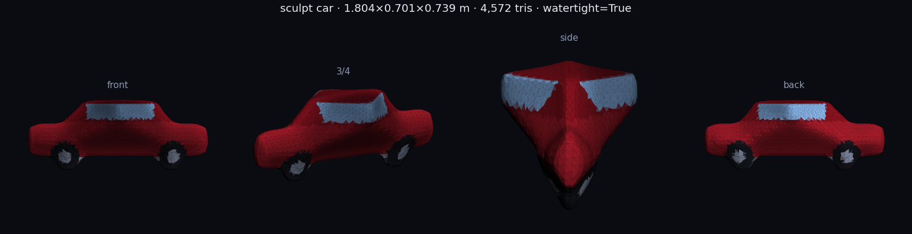
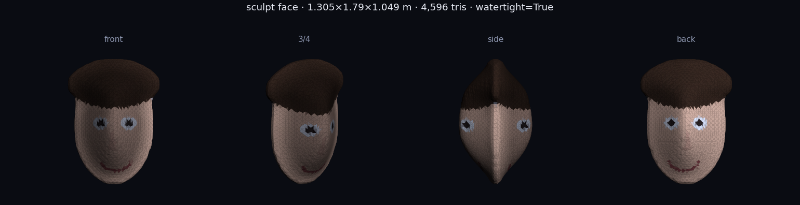
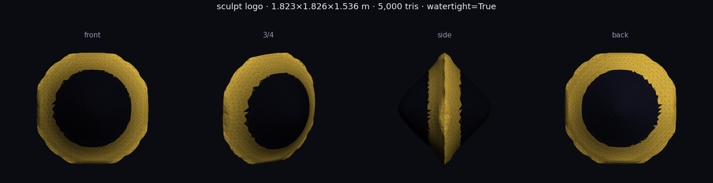
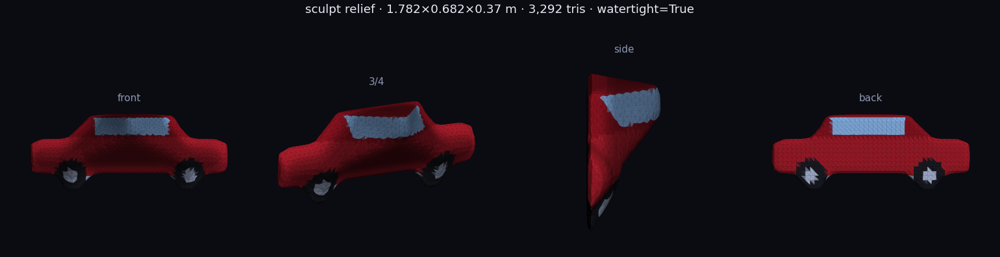
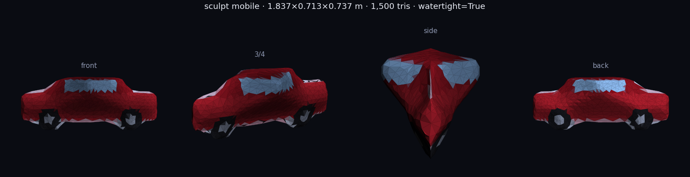
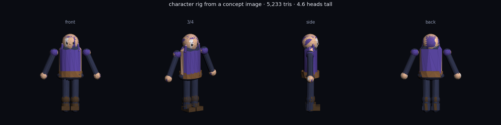

# Character Forge

**Live:** https://character-forge.onrender.com · **Code:** https://github.com/favour187/character-forge

Upload *any* image — a concept drawing, a game sprite, a photo of a toy, a logo, a bust — and get a
**game-ready 3D model** back: GLB with PBR textures, OBJ+MTL, and an STL you can slice. Or describe a
character in one sentence and get a rigged-style figure with the proportions, colours and gear you asked for.
Everything runs on CPU in about a second, on a **free** Render instance with 512 MB and 0.1 core.

---

## Main objectives

1. **Any image in, a real 3D model out.** Not a preview, not a render — a mesh with UVs, PBR maps and a
   closed, printable surface. A side view of a car must stay as flat as a car, a coin must come out as a coin.
2. **Zero "AI soup".** Deterministic, inspectable reconstruction: every triangle is explained by the
   silhouette or by the artwork's own light and shade. No random blobs, no melting faces, no floating junk.
   Where the camera cannot see, we say so in the report instead of hallucinating.
3. **Fit the constraints of a free tier.** 512 MB, 0.1 CPU, ephemeral disk, cold starts. The pipeline is
   built around that ceiling and enforces it in code — see [docs/MEMORY.md](docs/MEMORY.md).
4. **Game-ready means numbers.** Triangle budget honoured (mobile 1.5k / game 5k / hero 15k), one material,
   one draw call, Y-up metres, A-pose, watertight where it matters for STL.
5. **Talk to it.** A conversational UI: "make the back flat", "give it more volume", "under 2000 tris",
   "make the robe red" — each turn rebuilds the same subject with that change applied.
6. **Every stage swappable.** Each stage is a function with a small contract, so a neural model
   (TripoSR / InstantMesh / Hunyuan3D for reconstruction, a diffusion painter for textures) can replace
   one stage without touching the rest — see [Swapping in a neural model](#swapping-in-a-neural-model).
7. **Usable on a phone.** The site is the product: drop, forge, orbit, download — one column, big targets,
   a Build / 3D tab switch on small screens.

### Limits worth knowing (measured, not guessed)

* **One image sees one side.** The rear is mirrored from the front silhouette (or measured, if you upload a
  back view). Details hidden from the camera — a backpack strap, an open coat — are inferred, and the report
  says so instead of pretending.
* **Depth is a prior, not a measurement.** Where the silhouette narrows (a car's wheels, a hat brim), a
  single-view reconstruction tapers too, so a side view of a car looks wedge-like from the front. That is
  shape-from-silhouette being *honest* about its input, not a bug to hide: two views fix it.
* **Silhouette fidelity is exact, surface detail is a normal map.** Geometry follows your outline
  pixel-for-pixel; the fine stuff (eyes, folds, panel lines) is baked from the art's own shading, so it reads
  correctly in-engine and does not survive a close-up silhouette check.
* **Text-to-3D is parametric**, not generative: descriptions build a stylised rigged figure, because there
  are no pixels to measure.

### What it is not

It is **not** a diffusion-based image-to-3D model. Those need a GPU (or a paid API), minutes, and
hundreds of MB; this has to live on a free 0.1-CPU box and answer in a second. So the geometric part is
classical computer vision (shape from silhouette + shape from shading + marching cubes), and the AI part is
used where an LLM actually helps: *deciding* what to build. Honest 2.5D reconstruction from one photo
beats a blurry guess at a full mesh, and it is verifiably faithful to your input — the silhouette matches
pixel for pixel.

---

## The two reconstructors

`mode=auto` picks between them per input; you can also force either from the UI or the API.

```
                          ┌──────────────────────────────────────────────┐
  IMAGE ──► isolate ──►   │  router: is this a head-to-toe figure?        │
  (alpha or margin-LUT     │   yes ──► CHARACTER RIG (engine.build_character)│
   segmentation, heads-    │   no  ──► SCULPT (sculpt.reconstruct)         │
   tall + aspect + skin)   └──────────────────────────────────────────────┘
        TEXT ──► always CHARACTER RIG (there are no pixels to measure)

  SCULPT: per-row silhouette ellipse lofting ─┐
          inscribed-disc depth bound         ├─► half-depth field ─► implicit solid
          luminance high-pass (shading)      ┘        f(x,y,z)=min(Zf−z, Zb+z)
                                                              │ marching cubes
                                                              ▼
                                            watertight mesh ─► decimate ─► UV ─► bake ─► GLB/OBJ/STL
```

| | **Sculpt** (any subject) | **Character rig** (humanoids) |
|---|---|---|
| Input | any image | text, or an image that looks like a full body |
| Geometry | reconstructed from pixels: silhouette runs lofted as circular cross-sections, depth capped by the largest disc that fits inside the outline, bumps from the art's own shading | parametric volumes (head, hair, torso, limbs, boots + accessories) in A-pose |
| Topology | one closed watertight surface; `relief` mode = flat back | several volumes merged into one material |
| Textures | sampled straight from your artwork; normal map baked from the same depth field so detail survives decimation | per-part tiles from the art (image input) or procedural weave/grain/strands (text) |
| Back side | inferred by symmetry, or **measured** if you upload a back view | semantic defaults + symmetry, stated in the report |
| Good for | props, vehicles, logos, busts, sprites, coins, print-ready reliefs | stylised characters, chibis, heroes, anything you want posed and rigged later |

Both paths then run the same tail: quadric decimation to your triangle budget, one material, GLB / OBJ+MTL /
STL, three PNG maps and a JSON report.

---

## Samples

Renders of the exported meshes (four camera angles, textured, vertex-tinted back) — produced by
`python tests/preview.py`, so they are reproducible from the code in this repo:

| a side view stays a *car*, not a balloon | a face crop becomes a bust | a logo becomes a coin-like solid |
|---|---|---|
|  |  |  |

| relief (flat back, for printing) | mobile budget (1.5k tris) | character rig from concept art |
|---|---|---|
|  |  |  |

Every image above is regenerated from the fixtures by `python3 tests/preview.py`, so the
samples track the code instead of rotting. `docs/` also holds the write-up of the memory
limit ([`docs/MEMORY.md`](docs/MEMORY.md)) and the full HTTP contract ([`docs/API.md`](docs/API.md)).

## UI

Single page, no CDN (three.js is vendored), no framework:

* **Drop zone** for the front view, optional **back view** slot for a two-view hull, paste from clipboard,
  drag anywhere on the page, and the chosen file is echoed back with its pixel size and weight.
* **Mode / relief / depth / budget / AI director** controls, remembered in `localStorage`.
* **Progress overlay** with the real stage list and an honest "a cold instance takes ~50 s to wake" note,
  plus automatic single retry when the server answers `429` because a build is already running.
* **Result card**: brief, measured stats (triangles, vertices, largest side, watertight, build seconds,
  RAM left), the build plan, per-stage timings, the three texture maps, and the four downloads.
* **3D stage**: orbit / pinch-zoom, Material · Anime · Wireframe · Normals · UV shading, turntable,
  framing reset, PNG snapshot of the viewport, fullscreen.
* **Gallery drawer** of recent builds (Postgres-backed when `DATABASE_URL` is set, so it survives deploys).
* Responsive from 360 px up: below 900 px the two panes become **Build / 3D model** tabs, controls and
  buttons keep 44 px touch targets, `prefers-reduced-motion` is honoured, and everything is labelled for
  screen readers (`role=tablist`, `aria-live` status, `aria-pressed` toggles, visible focus rings).

---

## Run it

```bash
pip install -r requirements.txt
python server.py                      # → http://localhost:8000
python tests/check.py                  # end-to-end check against that server
python forge_cli.py --image concept.png --mode sculpt --depth 0.8 --out out/hero
```

No API key is needed: the rule-based planner and the sculptor are local. Set `OPENROUTER_API_KEY` to let a
language model act as the build director for the character rig (see [docs/API.md](docs/API.md)).

## API

`POST /chat` (conversational, keeps the session) and `POST /generate` (one-shot) take the same fields:
`text` or `image`, optional `back_image`, `mode` (`auto|character|sculpt`), `budget`
(`auto|mobile|game|high`), `relief`, `roundness` (0.25–1.6 depth multiplier), `use_ai`.
Full reference with curl examples and the report schema: **[docs/API.md](docs/API.md)**.

```bash
curl -s -F image=@car.png -F mode=sculpt -F budget=game https://character-forge.onrender.com/generate | jq '.size_m, .geometry.watertight'
```

## Environment variables

| Var | Default | Purpose |
|---|---|---|
| `OPENROUTER_API_KEY` | — | enables the AI build director (text/image → plan) |
| `OPENROUTER_MODEL` / `OPENROUTER_FALLBACK_MODELS` | free vision models | the model chain; failures fall back to the rule planner |
| `DATABASE_URL` | — | Neon/Postgres mirror of the gallery + artifacts |
| `FORGE_KEEP_ROWS` | `80` | rows kept in Postgres |
| `FORGE_KEEP_MODELS` | `24` | build folders kept on the ephemeral disk |
| `FORGE_QUEUE_WAIT_S` | `75` | how long a request waits for the single build slot before `429` |
| `FORGE_SERIALISE_BUILDS` | `1` | `0` disables the gate (only sane on a big instance) |
| `FORGE_MEMORY_MB` | auto-detected from the cgroup | pin the memory budget the guard plans against |
| `FORGE_MAX_TEXTURE` | `0` (auto) | force the atlas to 512 / 1024 / 2048 |
| `FORGE_MAX_UPLOAD_MB` | `16` | request body limit |
| `FORGE_PLAN_MAX_TOKENS` / `FORGE_PLAN_TIMEOUT_S` / `FORGE_PLAN_BUDGET_S` | `8000 / 60 / 150` | director call tuning |

## Layout

```
├── engine.py        6-stage pipeline, mode router, natural-language directives, exports
├── sculpt.py        image → watertight mesh (silhouette + shading + marching cubes)
├── memguard.py      512 MB discipline: build slot, atlas sizing, malloc_trim
├── director.py ai.py  AI build director over OpenRouter (optional)
├── db.py            optional Neon persistence
├── server.py        Flask API + static hosting
├── forge_cli.py     command line
├── static/
│   ├── index.html   the studio (vanilla JS, responsive, offline-capable)
│   └── vendor/      three.js r160 — vendored, so no CDN dependency
├── tests/
│   ├── check.py     end-to-end check: run it locally or against the live URL
│   └── fixtures.py  synthetic art drawn in code (car / face / logo / knight)
├── docs/            API.md · MEMORY.md · sample + sculpt previews
├── render.yaml Procfile DEPLOYMENT.md
└── models/ sessions/    generated at runtime (git-ignored)
```

## Swapping in a neural model

The contract each stage honours is what makes this swappable:

* **Reconstruct** — `sculpt.reconstruct()` returns `(mesh, uv, (base, mr, normal), report)`. Return the same
  tuple from a TripoSR / InstantMesh / Hunyuan3D inference call and both the UI and the exporter work
  unchanged. `engine.run_sculpt()` is the seam.
* **Analyze** — `ai.py` already speaks to any OpenRouter model; point `OPENROUTER_MODEL` at a stronger
  vision model when you have credits.
* **Texture** — feed the UV layout to a diffusion painter instead of `sculpt.bake()`.
* **Memory** — anything you swap in must fit the guard: size the atlas with `memguard.tex_size()` and hold
  `memguard.slot()` around the heavy part.

## Unity / Godot / Blender

* **GLB** — Unity: *glTFast* (`com.unity.cloud.gltfast`); Godot/Blender: open it directly. Materials,
  normal and metal/rough maps import automatically; the tinted back is `COLOR_0`, which glTF multiplies over
  the base colour.
* **OBJ** — native Unity import; assign `texture_atlas.png`, `normal_atlas.png`, `mr_atlas.png`
  (B = metal, G = rough).
* **STL** — geometry only, for slicing; the sculpt path reports `watertight: true` when it is safe to print.
* Scale 1 unit = 1 m, Y-up. The character rig is A-posed for Mixamo/Blender retargeting.

## Deploying / redeploying

Auto-deploy on push to `main`; the whole service is described in `render.yaml`. Details, the redeploy
command and how to attach Neon: **[DEPLOYMENT.md](DEPLOYMENT.md)**. If you care about the memory limit —
and on the free plan you do — read **[docs/MEMORY.md](docs/MEMORY.md)**: it has the measured peak of every
configuration and the exact OOM event this repo had.


## Real neural image-to-3D engine

Image builds can use the local TripoSR neural reconstructor instead of the CPU silhouette/primitive fallback. The learned model infers a full 3D surface from the reference image and Character Forge exports the resulting mesh as GLB.

The optional backend is in \`neural3d.py\`. Install \`requirements-neural3d.txt\` on a machine with enough RAM/VRAM and set \`FORGE_3D_ENGINE=triposr\`. The pretrained checkpoint is cached locally from Hugging Face rather than committed into Git history.

TripoSR is an open-source MIT-licensed model; its official implementation documents roughly 6 GB VRAM for a single-image run. The existing free Render configuration is only 512 MB, so it remains the lightweight fallback rather than pretending it can run the neural model.
